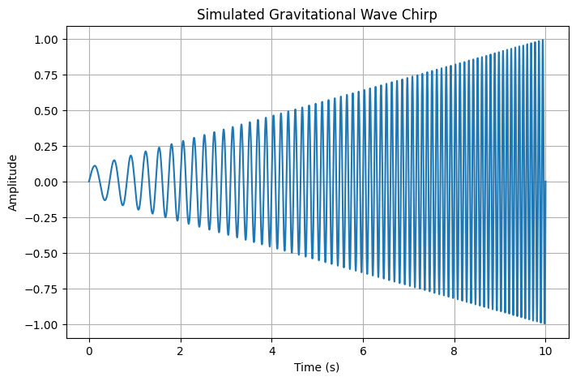
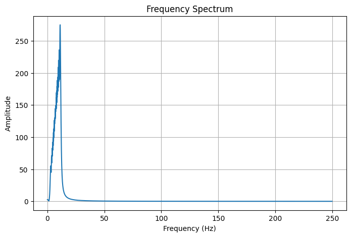

# Gravitational Wave Signal Analysis

## Abstract

Gravitational waves are disturbances in spacetime generated by accelerating massive objects. This project investigates a simulated gravitational-wave-inspired chirp signal using time-domain and frequency-domain analysis.

---

# Introduction

The direct detection of gravitational waves opened a new observational window into the universe.

These waves provide information about:

- Black hole mergers
- Neutron star collisions
- Compact binary systems

Signal processing techniques are essential for extracting information from gravitational wave observations.

---

# Theory

A gravitational-wave chirp is characterized by:

- Increasing frequency
- Increasing amplitude

This occurs because orbiting compact objects move faster as they lose energy through gravitational radiation.

---

# Numerical Method

The simulation consists of:

1. Generating a chirp waveform.
2. Plotting the waveform in the time domain.
3. Applying the Fast Fourier Transform.
4. Plotting the frequency spectrum.

---

# Results

## Figure 1: Simulated Gravitational Wave Chirp

The waveform displays increasing oscillation frequency over time, reproducing the characteristic chirp structure associated with inspiraling compact binaries.

---

## Figure 2: Frequency Spectrum

The Fourier spectrum reveals the distribution of frequencies contained within the signal. The broad frequency range reflects the continuously increasing frequency of the chirp waveform.

---

# Discussion

The simulation successfully reproduces the primary qualitative feature of gravitational wave signals: the chirp.

Although simplified, the model demonstrates how signal processing techniques can be applied to astrophysical data.

The Fourier Transform provides insight into the frequency content of the waveform and serves as a foundation for more advanced gravitational wave analysis methods.

---

# Applications

- Gravitational Wave Astronomy
- Black Hole Physics
- Neutron Star Research
- Signal Processing
- Astrophysical Data Analysis

---

# Conclusion

A gravitational-wave-inspired chirp signal was successfully generated and analyzed.

Both time-domain and frequency-domain representations were studied, illustrating key principles used in modern gravitational wave astronomy.

---

# References

1. Einstein, A. General Theory of Relativity.
2. Abbott et al. Observation of Gravitational Waves from a Binary Black Hole Merger.
3. Newman, Computational Physics.
4. Numerical Recipes in Scientific Computing.
