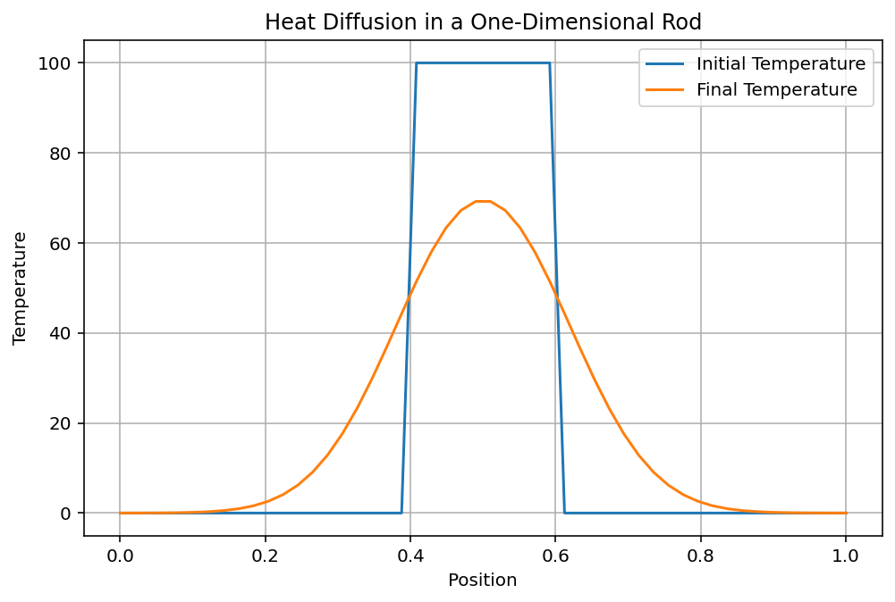

# Heat Equation Solver

## Overview

This project numerically solves the one-dimensional heat equation using the Finite Difference Method (FDM).

The simulation demonstrates how heat diffuses through a rod over time, starting from an initially localized hot region.

---

## Physics Background

Heat conduction in one dimension is governed by:

∂T/∂t = α ∂²T/∂x²

where:

- T = temperature
- t = time
- x = position
- α = thermal diffusivity

This equation describes the flow of heat from hotter regions to colder regions.

---

## Methodology

1. Discretize space into grid points.
2. Apply finite difference approximations.
3. Update temperature distribution over time.
4. Visualize the diffusion process.

---

## Results

### Heat Diffusion

The initially concentrated heat spreads through the rod as time progresses.

---

## Technologies

- Python
- NumPy
- Matplotlib

---

## Concepts Covered

- Partial Differential Equations (PDEs)
- Heat Equation
- Finite Difference Method
- Numerical Stability
- Scientific Computing

---

## Future Work

- 2D Heat Equation
- Animated Heat Diffusion
- Different Boundary Conditions
- Crank-Nicolson Method
- Thermal Conductivity Variations

---

## Author

Afreen Chaudhary
