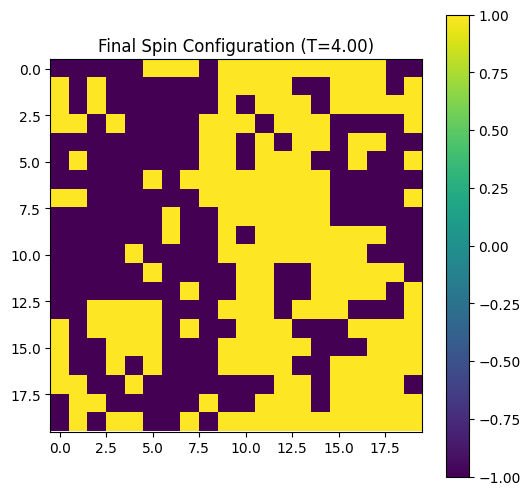
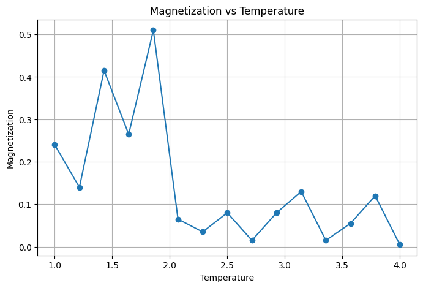
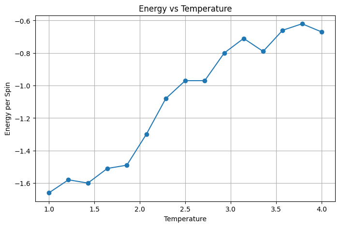

# Ising Model Simulation

## Overview

This project implements a Monte Carlo simulation of the two-dimensional Ising model using the Metropolis algorithm.

The Ising model is one of the most important models in statistical mechanics and condensed matter physics.

---

## Physics Background

Each lattice site contains a spin:

+1 (up)

or

-1 (down)

Neighboring spins interact through the Hamiltonian

H = -J Σ sᵢsⱼ

The competition between interaction energy and temperature leads to phase transitions.

---

## Methodology

1. Create a 2D lattice of spins.
2. Apply the Metropolis Monte Carlo algorithm.
3. Simulate thermal equilibrium.
4. Compute magnetization.
5. Compute energy.
6. Study temperature dependence.

---

## Results

### Final Spin Configuration

### Magnetization vs Temperature

### Energy vs Temperature

---

## Technologies

- Python
- NumPy
- Matplotlib

---

## Concepts Covered

- Statistical Mechanics
- Monte Carlo Methods
- Metropolis Algorithm
- Phase Transitions
- Magnetism

---

## Future Work

- Larger lattices
- Critical temperature estimation
- Heat capacity
- Magnetic susceptibility
- Animation of spin evolution
