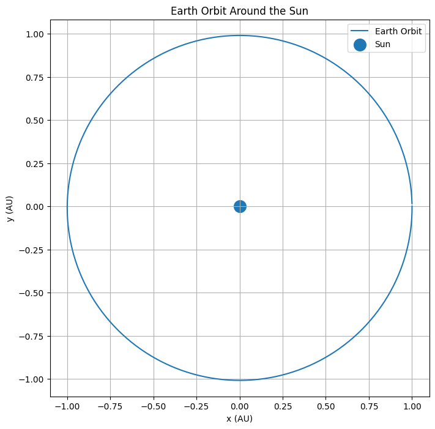

# N-Body Gravitational Simulation

## Abstract

This project models orbital motion using Newton's law of gravitation. A numerical simulation of Earth's orbit around the Sun is performed to study planetary dynamics.

---

# Introduction

Planetary motion is governed by gravitational interactions between celestial bodies.

Numerical methods allow these trajectories to be computed directly from physical laws.

---

# Theory

Newton's Law of Gravitation:

F = G(m₁m₂)/r²

Combining this with Newton's Second Law gives the acceleration experienced by each body.

---

# Numerical Method

At each timestep:

1. Compute distance from the Sun.
2. Compute gravitational acceleration.
3. Update velocity.
4. Update position.

This process generates the orbital trajectory.

---

# Results

The simulated orbit remains approximately circular, consistent with Earth's actual motion.

---

# Applications

- Astrophysics
- Celestial Mechanics
- Space Mission Design
- Planetary Science

---

# Conclusion

The simulation successfully demonstrates gravitationally bound orbital motion using numerical methods.

---

# References

1. Kepler, Laws of Planetary Motion
2. Newton, Principia Mathematica
3. Newman, Computational Physics
