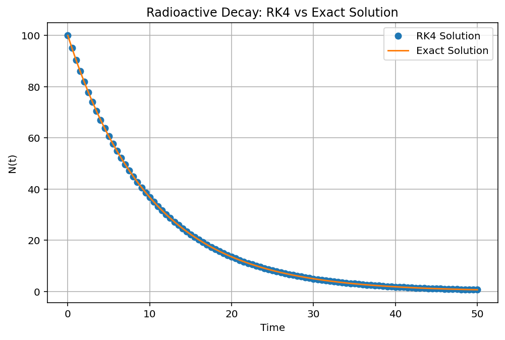

# RK4 Solver for Radioactive Decay

## Overview

This project implements the fourth-order Runge-Kutta (RK4) method to solve the radioactive decay equation.

## Theory

Radioactive decay follows:

dN/dt = -λN

Analytical solution:

N(t) = N₀e^(-λt)

The RK4 method is used to numerically approximate the solution and compare it with the exact analytical result.

## Results

### Numerical vs Analytical Solution

## Technologies

- Python
- NumPy
- Matplotlib

## Concepts

- Ordinary Differential Equations
- Runge-Kutta Methods
- Numerical Analysis
- Error Estimation
