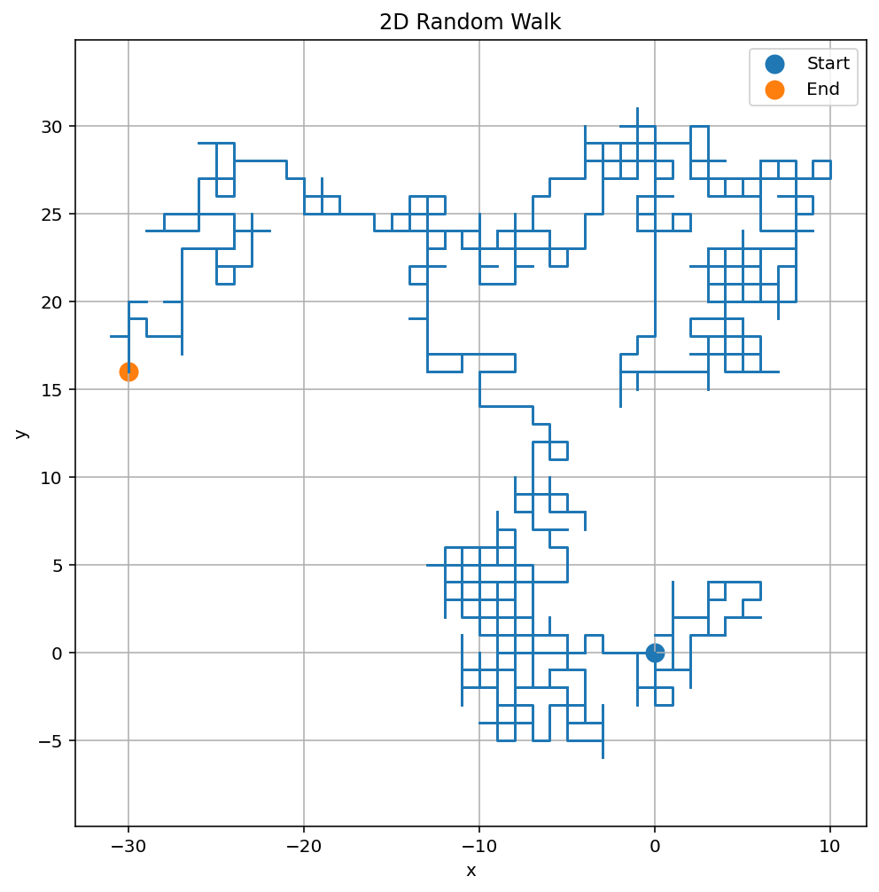
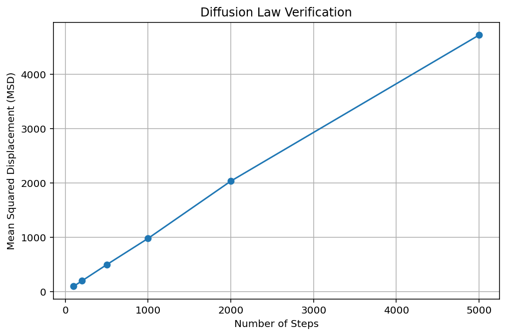

# Random Walk and Diffusion

## Abstract

Random walks provide a simple yet powerful model for understanding stochastic processes and diffusion phenomena. In this project, a two-dimensional random walk was simulated and the diffusion law was verified using numerical experiments.

---

# Introduction

Many physical systems involve random motion. Examples include:

- Brownian motion
- Molecular diffusion
- Heat transport
- Population dynamics

Random walks provide a mathematical framework for studying these systems.

---

# Theory

At every step, the particle moves randomly in one of four directions.

For a large number of walks, the mean squared displacement is defined as

MSD = <r²>

where

r² = x² + y²

Diffusion theory predicts

MSD ∝ t

where t is the number of steps.

---

# Methodology

1. Simulate a 2D random walk.
2. Record the final position.
3. Calculate squared distance.
4. Repeat for 1000 independent walks.
5. Compute mean squared displacement.
6. Study its dependence on the number of steps.

---

# Results

## Random Walk Trajectory

## Diffusion Law

The MSD plot shows an approximately linear relationship between mean squared displacement and the number of steps.

This confirms the theoretical prediction:

MSD ∝ t

---

# Applications

Random walks are used in:

- Statistical Physics
- Condensed Matter Physics
- Astrophysics
- Financial Modeling
- Ecology
- Machine Learning

---

# Conclusion

The simulation successfully reproduced the diffusion law. The mean squared displacement increased linearly with the number of steps, demonstrating one of the most important results in statistical physics.

---

# Future Work

- Three-dimensional diffusion
- Continuous Brownian motion
- Anomalous diffusion
- Lévy flight simulations
- Monte Carlo transport methods

---

# References

1. Newman, Computational Physics.
2. Landau, Computational Physics.
3. Einstein, On the Motion of Small Particles Suspended in Liquids.
